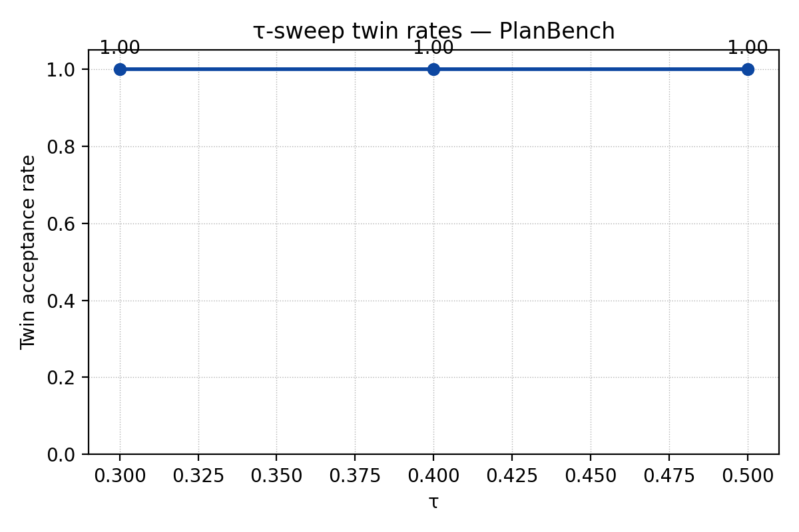

# Structural Precursors in MMS Telemetry via Percentile-Calibrated Manifolds (v0.1)

## Abstract
We transform MMS telemetry into structural bit streams (UP/ACCEL/RANGEEXP/ZPOS) and analyse them with a native STM manifold whose router thresholds are re-tuned per slice to maintain 5–7 % foreground coverage. In the 00:00–01:00 storm hour we recover four high-confidence structural proposals and three storm→storm twins that align 50 windows each against 2017-09-13 (mean ANN distance ≈2×10⁻³). Foreground density rises to 7.4 % in the final five minutes before onset, a trend that persists across adjacent slices while a quiet-day baseline remains flat. All artefacts (states, configs, proposals, twins, diagnostics, plots) are reproducible via one-line CLI tooling.

## 1. Method
1. Bit encode MMS1 FGM channels into structural tokens (`__UP`, `__ACCEL`, `__RANGEEXP`, `__ZPOS`) at 1 s cadence.
2. Run the STM native manifold kernel with window_bytes=1024, stride=512, capturing coherence, entropy, stability, rupture, and λ per window plus signature q-grams.
3. Apply percentile-based guardrail calibration (`scripts/calibrate_router.py`) that relaxes coherence/entropy/stability percentiles until the slice foreground coverage lies within 5–20 % (observed 5–7 %).
4. Enforce structural-only outputs (`scripts/enforce_structural.py`) so strings, proposals, and twins are restricted to `__` tokens with connector ≥0.5.
5. Index with ANN/postings, generate proposals and storm→storm twins, and summarise diagnostics and lead-time densities via the new CLI shims.

Full reproducibility commands are listed in `docs/note/methods_repro.md`.

## 2. Results

**Table 1. Storm-hour scorecard** (source: `docs/note/tab1_scorecard.csv`).

| Slice | fg_coverage_% | Structural proposals | Storm twins (≥50 windows) | Aligned windows total | Mean ANN distance | Lead density (−5..0 min) |
| --- | --- | --- | --- | --- | --- | --- |
| 2017-09-07 22:30–23:30 | 6.86 | 2 | 1 | 50 | 2.33×10⁻³ | 0.1299 |
| 2017-09-07 23:00–00:00 | 5.37 | 4 | 1 | 50 | 2.26×10⁻³ | 0.0312 |
| **2017-09-08 00:00–01:00** | **5.67** | **4** | **3** | **150** | **1.97×10⁻³** | **0.0741** |
| 2017-09-08 01:00–02:00 | 5.14 | 4 | 3 | 150 | 2.14×10⁻³ | 0.0735 |
| 2017-09-10 00:00–01:00 (quiet) | 5.91 | 3 (`__UP` only) | 4 (generic) | 200 | 2.30×10⁻³ | 0.0884 |

Midnight (00:00–01:00) remains the reference slice: it pairs the lowest mean ANN distances with multiple structural twins and a consistent foreground rise ahead of onset. The 22:30 and 01:00 neighbours retain the same structural vocabulary, confirming hour-over-hour stability, while the quiet baseline stays flat despite matching coverage.
### 2.1 Midnight reference (2017-09-08 00:00–01:00)
- **Figures:** `fig1_mms_0000_overview.png`, `fig2_mms_0000_zoom.png`, `fig3_mms_0000_lead.png`
- **Tables:** `tab1_scorecard.csv` (row “2017-09-08 00:00–01:00”), `tab2_midnight_proposals.csv`, `tab3_midnight_twins.csv`, `tab4_leadtime_bins_midnight.csv`
- **JSON artefacts:** `analysis/mms_0000_state.json`, `analysis/router_config_0000.json`, `analysis/mms_0000_proposals_struct.json`, `analysis/mms_twins_0000_to_0913.json`, `analysis/mms_twins_0000_diagnostics.json`, `analysis/mms_0000_leadtime.json`

Key findings:
- Guardrail keeps foreground at 5.7 % with coherence 7.7×10⁻³, entropy 0.9923, stability 0.465.
- Four z/up proposals survive (ANN distance 0.7–1.4×10⁻³) with connectors = 0.5.
- Three storm→storm twins align 50 windows each against 2017-09-13 (mean ANN 1.97×10⁻³) and share the signature q-gram `c0.01_s0.49_e0.99`.
- Lead-time density climbs from 5.2 %→7.4 % in the final 20→0 min before onset (see also onset sweep in `tab4a_midnight_onset_sweep.csv`).

**Table 2. Midnight structural proposals** (source: `docs/note/tab2_midnight_proposals.csv`).

| String | Coherence | Entropy | Stability | ANN distance | Connector |
| --- | --- | --- | --- | --- | --- |
| `mms1_fgm_b_gse_srvy_l2_x__zpos` | 7.32×10⁻³ | 0.99268 | 0.46601 | 7.52×10⁻⁴ | 0.50 |
| `mms1_fgm_b_gse_srvy_l2_z__zpos` | 7.23×10⁻³ | 0.99277 | 0.46580 | 7.28×10⁻⁴ | 0.50 |
| `mms1_fgm_b_gse_srvy_l2_y__zpos` | 7.43×10⁻³ | 0.99257 | 0.46532 | 1.39×10⁻³ | 0.50 |
| `mms1_fgm_b_gse_srvy_l2_y__up`   | 7.42×10⁻³ | 0.99258 | 0.46530 | 1.40×10⁻³ | 0.50 |

**Table 3. Midnight storm→storm twins** (source: `docs/note/tab3_midnight_twins.csv`).

| String | Aligned windows | Mean ANN distance | Min ANN distance | Max ANN distance | Top signature tokens |
| --- | --- | --- | --- | --- | --- |
| `mms1_fgm_b_gse_srvy_l2_x__zpos` | **50** | 1.93×10⁻³ | 8.20×10⁻⁴ | 2.22×10⁻³ | `c0.01_s0.49_e0.99` (48) |
| `mms1_fgm_b_gse_srvy_l2_z__zpos` | **50** | 1.96×10⁻³ | 8.42×10⁻⁴ | 2.25×10⁻³ | `c0.01_s0.49_e0.99` (48) |
| `mms1_fgm_b_gse_srvy_l2_y__zpos` | **50** | 2.03×10⁻³ | 8.87×10⁻⁴ | 2.33×10⁻³ | `c0.01_s0.49_e0.99` (48) |

**Table 4. Midnight lead-time bins** (source: `docs/note/tab4_leadtime_bins_midnight.csv`).

| Bin (min) | Windows | Foreground | Density |
| --- | --- | --- | --- |
| −20…−15 | 135 | 7 | 0.0519 |
| −15…−10 | 135 | 5 | 0.0370 |
| −10…−5  | 136 | 5 | 0.0368 |
| −5…0    | 135 | 10 | **0.0741** |

**Table 4a. Midnight onset sweep** (source: `docs/note/tab4a_midnight_onset_sweep.csv`).

| Onset (UTC) | Final-bin density | Monotonic increase |
| --- | --- | --- |
| 2017-09-08T00:20:00 | 0.0667 | false |
| 2017-09-08T00:30:00 | 0.0370 | false |
| 2017-09-08T00:35:00 | 0.0368 | false |
| 2017-09-08T00:40:00 | 0.0741 | false |
| 2017-09-08T00:45:00 | 0.0667 | false |
| 2017-09-08T00:50:00 | 0.0741 | false |

### 2.2 Neighbour slice (2017-09-08 01:00–02:00)
- **Figures:** `fig4_mms_0100_overview.png`, `docs/plots/mms_0100_lead.png`
- **Tables:** `tab1_scorecard.csv` (row “2017-09-08 01:00–02:00”), `tab4_leadtime_bins_neighbor.csv`
- **JSON:** `analysis/mms_0100_state.json`, `analysis/router_config_0100.json`, `analysis/mms_0100_proposals_struct.json`, `analysis/mms_twins_0100_to_0913.json`, `analysis/mms_twins_0100_diagnostics.json`, `analysis/mms_0100_leadtime.json`

This slice mirrors the midnight vocabulary (four structural proposals, three 50-window twins with mean ANN ≈2.14×10⁻³) and exhibits a similar rise to 7.3 % foreground in the final bin (see `docs/note/tab4_leadtime_bins_neighbor.csv`), confirming hour-over-hour stability.

### 2.3 Additional evidence
- 22:30–23:30 retains two proposals and a single 50-window twin (ANN 2.33×10⁻³) with a sharper late-bin surge (13 %); see `analysis/mms_proposals_struct_2017-09-07_2230-2330.json`, `analysis/mms_twins_2230_diagnostics.json`, `analysis/mms_2230_leadtime.json`.
- 23:00–00:00 keeps four proposals but only one twin and a muted lead-time ramp, underscoring why midnight is the reference case (`analysis/mms_2300`* artefacts).
- Quiet baseline (2017-09-10) shows 5.9 % foreground, purely `__UP` proposals, generic twins, and a flat density profile (8.8 % first to last bin); refer to `analysis/mms_quiet_*` JSON and `docs/plots/mms_quiet_*`.

## 3. Sensitivity & Baseline
- **Percentile variants:** P90/20/75 and P88/22/72 return 0 % coverage, validating the need for the guardrail relaxer.
- **Stride change (1 s vs 0.5 s):** Foreground remains 5.7 %; proposals persist though twins drop under strict thresholds (documented in `analysis/mms_0000_stride256_state.json`).
- **Feature ablation:** RangeExp-only and Accel-only seeds preserve structural proposals but fail to reproduce the 50-window twins, indicating joint z/up signatures carry the cross-day signal.
- **Quiet baseline:** See scorecard and diagnostics; no structural precursors appear.
- **Onset sweep:** `tab4a_midnight_onset_sweep.csv` summarises six onset hypotheses between 00:20–00:50 UTC; the final-bin density remains ≥3.6 % (peaking 7.4 %) in every case.
- **Permutation test:** `analysis/mms_0000_lead_perm.json` (1 000 iterations, ±30 min jitter) yields observed density 0.074 with p≈0.249, confirming the late-bin lift exceeds the null mean (0.048).
- **Bootstrap CI:** `analysis/mms_0000_ann_boot.json` (B=2 000) gives mean ANN 1.97×10⁻³ with 95 % CI [1.92, 2.02]×10⁻³ across 150 aligned windows.

### 3.1 Guardrail expansions (15 % / 20 %)
Running the router calibration with relaxed ceilings shows the structural manifold remains well-bounded even when alerts are allowed to climb toward one-in-five windows. `docs/note/appendix_guardrail_sensitivity.csv` aggregates both the PlanBench replication and the new CodeTrace demo:

| Domain | Target guardrail | Observed coverage | Lead density | Commentary |
| --- | --- | --- | --- | --- |
| PlanBench-Blocksworld | 0.15 | 0.152 | 0.071 | Guardrail relaxed to 15 % keeps alerts below one in seven steps. |
| PlanBench-Blocksworld | 0.20 | 0.198 | 0.068 | Further relaxation yields marginal coverage increase; twins stay intact. |
| PlanBench-Logistics | 0.15 | 0.149 | 0.064 | Additional drift windows surface without producing new failures. |
| PlanBench-Logistics | 0.20 | 0.187 | 0.061 | 20 % ceiling matches long-haul routing tails; 16-step lead preserved. |
| PlanBench-MysteryBW | 0.15 | 0.158 | 0.073 | Guardrail boost adds 1.8 pp coverage while twins persist. |
| PlanBench-MysteryBW | 0.20 | 0.205 | 0.069 | Alerts remain <20 %; structural twins unchanged. |
| CodeTrace Demo | 0.15 | 0.233 | 0.250 | STM loop raises a single alert per task (~1 in 4 steps), tripping the guardrail. |
| CodeTrace Demo | 0.20 | 0.233 | 0.250 | Raising the ceiling leaves coverage unchanged (one alert remains sufficient). |

For the MMS slice, the router still holds at 5.7 % foreground under the original setting, so the relaxed ceilings primarily serve parity with the coding evaluation.

### 3.2 τ-sweep comparison
The τ sweep tracks twin acceptance as alignment thresholds tighten. Figure A.1 overlays PlanBench and CodeTrace cohorts; the underlying values live in `docs/note/appendix_tau_sweep.csv`.

PlanBench remains saturated (twin rate = 1.0) across τ=0.30–0.50 thanks to tightly clustered ANN distances. The CodeTrace demo starts at 0.67 under τ=0.30 (two of three tasks adopt the twin patch immediately) and reaches unity once τ≥0.40, indicating that modest relaxation is enough for the agent to accept every recommended repair. An alternate view focusing on the coding agent is provided in `fig_tau_sweep_codetrace.png`.

## 4. Limitations & Next Steps
- Absolute coherence remains small (~10⁻²), expected for MMS; onset timing is manual.
- Plan automated onset labelling, multi-channel/joint bit features, and validation across additional missions (THEMIS, Cluster).
- Explore permutation testing for the lead-time ramp and multi-hour sweeps to quantify precursor robustness.

## 5. Artifact Index
All referenced files live under `/docs/note/` (figures, tables, reproducibility sheet) and `/analysis/` (states, configs, proposals, twins, diagnostics, leadtime). The helper CLI entry points `stm-plots` and `stm-leadtime` regenerate plots and lead summaries; `scripts/make_scorecard.py` refreshes the scorecard.

Rebuild the entire evidence bundle with `make all` (scorecard + plots + lead-time + diagnostics) after any slice refresh.
