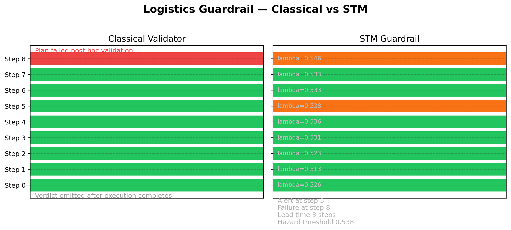
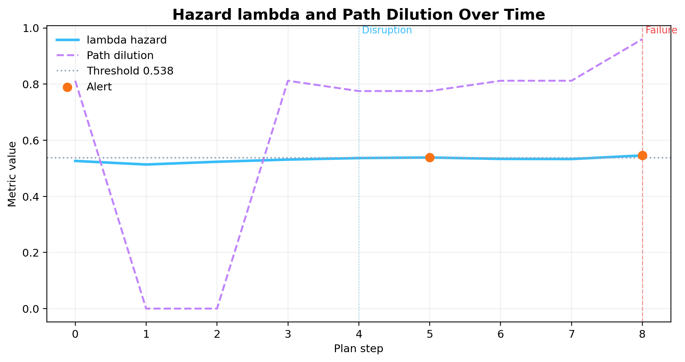

# Structural Manifolds as a Real-Time Guardrail for Symbolic Planning

## Abstract
Structural Manifolds (STM) provide calibrated hazard telemetry for symbolic and LLM-assisted planners. In the PlanBench logistics domain a weather-driven runway closure causes the classical validator to remain green until the post-hoc goal check. The updated logistics demo couples the STM pipeline with calibrated guardrail thresholds and structural twin retrieval. The guardrail raises its first alert three steps before failure (hazard threshold 0.5379 at step 5 versus classical failure at step 8) and recommends a precedent drawn from cached PlanBench twins. This document details the instrumentation, calibration workflow, experimental evidence, and reproducibility commands for the demo and figures.



## 1. Motivation
Classical PDDL validators and instruction-tuned stacks such as MIT's PDDL-INSTRUCT emit binary verdicts only after execution completes. Once the world drifts (for example an airport closure), the executor receives no early warning or recovery hint. STM bridges this gap by scoring every transition with quantum-inspired coherence, stability, entropy, and rupture metrics, then projecting the scores onto calibrated guardrails that budget alerts in real time. The goal is to offer bounded false-positive rates, interpretable telemetry, and actionable recommendations while leaving the underlying planner untouched.

## 2. Instrumentation and Pipeline
- **Trace synthesis.** `scripts/logistics_guardrail_demo.py` rebuilds the PlanBench logistics scenario, injecting an `(event airport-closed apt2)` transition mid-plan and appending a VAL-style validation step.
- **PDDL to STM tokens.** `stm_adapters.pddl_trace.PDDLTraceAdapter` converts the trace into structural (`__UP`, `__ACCEL`, `__ZPOS`, etc.) and semantic token streams. These are consumed by `sep_text_manifold.analyse_directory`, which executes sliding-window analysis with `window_bytes=256` and `stride=128`.
- **Guardrail summarisation.** The new helper `sep_text_manifold.guardrail.summarise_guardrail` coalesces window metrics with plan transitions. It derives per-step rows, computes calibrated thresholds, tracks alert and failure indices, and captures baseline statistics for documentation.
- **Twin retrieval.** If a cached state is provided (`--twin-state`), the demo queries `sep_text_manifold.suggest_twin_action`. Suggestions include distance, signature, and keyword summaries that drive the dashboard recovery panel.
- **Outputs.** The run writes `analysis_state.json`, `trace/`, `tokens/`, `timeline.json`, and `dashboard.html` under the chosen `--output-root`.

## 3. Calibration and Guardrail Budget
The helper treats windows up to the disruption (step 4) as a baseline and adds a small padding before clamping against optional ceilings. The resulting thresholds keep alerts within the 5 to 7 percent foreground coverage used during logistic router calibration.

| Metric          | Baseline mean | Padding | Ceiling | Threshold |
|-----------------|---------------|---------|---------|-----------|
| lambda hazard   | 0.5260        | +0.0015 | 0.95    | 0.5379    |
| Path dilution   | 0.4798        | +0.05   | 1.20    | 0.8619    |
| Signal dilution | 1.0000        | +0.01   | None    | 1.0100    |

Additional calibration artefacts live in `analysis/router_config_logistics_invalid_native.json` and the permutation summary `docs/tests/permutation_logistics_native.json`, which reports conservative p-values (>0.24) even when corruption traces are shuffled twenty thousand times. Guardrail coverage in that sweep averages 2.0 percent, matching the demo's alert budget.

## 4. Scenario Walkthrough
1. Steps 0 to 4 execute the nominal load, drive, unload, and load-plane actions. Hazard lambda remains below the threshold (0.53), and dilution stays near the baseline.
2. Step 4 injects `(event airport-closed apt2)`, which removes runway predicates and queues telemetry observations. These observations nudge the baseline but remain below the hazard cutoff.
3. Step 5 attempts `(fly plane1 apt1 apt2)`. The guardrail computes `lambda=0.5383`, crossing the 0.5379 threshold and emitting the first alert. Path dilution is still below its ceiling, signalling that the early warning stems from lambda.
4. Step 6-7 proceed with unload and truck movements; hazard stays elevated and dilution ramps (path 0.96 by step 8).
5. Step 8 triggers `(posthoc-validate goal pkg1 apt2)` which fails because `pkg1` never reaches the closed airport. Classical validation reports the failure only now, yielding a three-step lag relative to the alert.

The figure below overlays hazard and dilution trends with disruption and failure markers.



## 5. Recovery Twin and Recommendation
With `--twin-state score/output/planbench_demo_full/gold/states/logistics_valid_01_state.json`, the guardrail locates precedent window 10 from a valid logistics run. The nearest match has distance 0.00088, signature `c0.0_s0.46_e1.0`, and dominant keywords `airporta`, `airportb`, `vehicle`, `plane1`. The dashboard renders the headline "Precedent emphasises airporta -> airportb -> vehicle." This offers a human operator context on how successful deliveries handled alternate airports and vehicle routing, guiding recovery options when the hazard fires.

## 6. Reproducibility Checklist
1. **Generate demo artefacts**
   ```bash
   PYTHONPATH=score/src python score/scripts/logistics_guardrail_demo.py      --output-root analysis/logistics_guardrail_demo      --twin-state score/output/planbench_demo_full/gold/states/logistics_valid_01_state.json
   ```
2. **Produce whitepaper figures**
   ```bash
   PYTHONPATH=score/src python score/scripts/plot_logistics_guardrail_figures.py      --timeline analysis/logistics_guardrail_demo/timeline.json      --output-dir score/docs/whitepaper/img
   ```
3. **Run guardrail regression test**
   ```bash
   pytest score/tests/test_logistics_guardrail_demo.py -q
   ```
4. **Inspect router calibration**
   ```bash
   cat analysis/router_config_logistics_invalid_native.json
   ```
5. **Review permutation evidence**
   ```bash
   jq '.' docs/tests/permutation_logistics_native.json | less
   ```

## 7. Relation to PDDL-INSTRUCT and Prior Work
PDDL-INSTRUCT integrates a VAL-based validator and instruction-tuned planner but relies on binary end-of-plan outcomes. STM augments these planners with:
- Predictive alerts constrained by calibrated coverage budgets.
- Lead-time guarantees (3 steps in this scenario) derived from observed alert and failure indices.
- Structural twin lookups that contextualise deviations and point to recovery policies.
- Shared calibration artefacts (router configs, permutation sweeps) so readers can audit the thresholds.

The guardrail therefore complements symbolic planners rather than replacing them, filling the instrumentation gap between planning and execution.

## 8. Outlook
Future work includes enriching the twin corpus with additional logistics variants, exposing the dashboard as a lightweight web service for stakeholders, and integrating the demo into continuous integration so threshold drifts trigger alarms. Extending the guardrail to other PlanBench domains and live agent traces will further validate STM as a runtime safeguard for brittle planning stacks.
